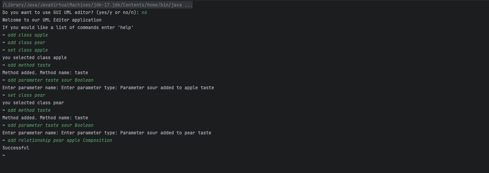
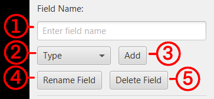

# UML Editor

v4.3.77
* How to read version # Version main branch_demo release_pull_request changes
* What's New:
  * GUI and CLI now on JavaFX
* Major changes:
  * Menu System
---

## Table of Contents

1. [Getting Started for User](#getting-started-for-User)
2. [Running the Application for User](#running-the-application-for-User)
3. [Overview](#overview)
4. [Features](#features)
5. [Installation for Developers](#installation-for-Developers)
6. [Testing](#testing)
7. [Dependencies](#Dependencies)
8. [Contributing](#contributing)
9. [License](#license)
10. [Contact](#contact)
11. [Project Details/Technical Document include Usage](#Project-Details)
---

## Getting Started for User

### Prerequisites

Ensure that the following software is installed on the target machine:

- **Java Runtime Environment (JRE)** or **Java Development Kit (JDK)** version 21.0.5 or higher.  
  You can download it from the [Oracle Java Downloads page](https://www.oracle.com/java/technologies/javase-downloads.html) or **Highly Recommend** [GraalVM for JDK 21.0.5](https://www.oracle.com/java/technologies/downloads/?er=221886#graalvmjava21).
- **JavaFX** version 21.0.5.
  You can download it from the [JavaFX Download page](https://gluonhq.com/products/javafx/).
  
---

## Running the Application for User

### Steps to Run the UML Editor

### 1. Obtain the Program File
Download the package https://github.com/hbarton2/cscd350-f24-AndTheyWereRoomates.git

### Make sure the main branch is selected

### Click on the green code button and click on Download Zip.

### Navigate to where the package was downloaded and extract the files
### Steps to Open Terminal and Run `umleditor.jar`


2. **Locate `uml-editor.jar`**:
    - Navigate to the directory where `uml-editor.jar` is located using your file explorer.

3. **Open Terminal/Command Prompt**:
    - **On Windows**:
        - Right-click inside the folder (not on the file) and select `Open in Terminal` or `Open PowerShell window here`.
    - **On macOS**:
        - Open Terminal, then type `cd` followed by a space.
        - Drag and drop the folder containing `uml-editor.jar` into the Terminal window.
        - Press `Enter` to navigate to the folder.
    - **On Linux**:
        - Open Terminal, then type `cd` followed by a space.
        - Drag and drop the folder containing `uml-editor.jar` into the Terminal window.
        - Press `Enter` to navigate to the folder.

4. **Run the JAR File**:
    - Type the following command in the commandLineTerminal:
      ```bash
      java -jar uml-editor.jar
      ```
    - Press `Enter` to execute the command.

*Did you know? If this file is currently viewed in a dedicated markdown viewer, you can click the arrow icon next to the bash command and launch the application.*


---

## Overview

DevKitUML is a unified modeling language (UML) software development kit (SDK) designed to simplify the process of generating, managing, and interacting with UML diagrams for developers. This project integrates a console-based interface for UML Editor functionality.

This SDK is intended to streamline the experience of creating class diagrams, modifying them, and saving/loading project data using JSON format for persistence.

---

## Features

- **Command-Line Interface (CLI):** Provides a commandLineTerminal-like environment where users can execute commands within the JavaFX commandLineTerminal window.
- **Graphical User Interface (GUI):** Application has an elegant, easy-to-use graphical interface for an enhanced user experience.
- **JSON Integration:** Uses Gson for saving/loading the project data in JSON format.
- **Multi-platform Support:** Designed to work on Windows, macOS, and Linux with cross-platform capabilities.

---

## Installation for Developers

### Prerequisites

Before running the project, ensure you have the following installed:

- **Java JDK 21.0.5**
- **Maven 3.9.9**

### Project Dependencies

The project uses the following dependencies, which are defined in the `pom.xml` file:

See the `pom.xml` file for full details on dependencies.
See [Dependencies](#Dependencies) for details preview.

### Building the Project

You can build the project using Maven. From the project root directory(where `pom.xml` is located)
run:

```bash
mvn clean package
mvn install
```

### Step-by-Step Instructions

```angular2html
src/main/java/uml-editor/EntryPoint.java
```

1. Clone the repository:
   ```bash
   git clone https://github.com/hbarton2/cscd350-f24-AndTheyWereRoomates
   cd cscd350-f24-AndTheyWereRoomates
   ```
   
2. Build the project using Maven:
   ```bash
   mvn clean package
   mvn install
    ```   

3. Run the project:
   ```bash
   java -jar target/original-uml-editor-shaded.jar
   ``` 
---

### JSON Integration
The project uses Gson for storing and loading UML project data as JSON files. The data includes class names, attributes, and methods, allowing for an easily shareable format.

### Testing


JUnit 4 or 5 and Mockito is used for all testing throughout the project. To run the tests, use:

```bash
mvn test
```
---

## Run Tests
To run unit tests, execute the following command:
```bash
mvn test
```
Testing is performed using JUnit 5 and includes:
- Unit tests for core functionalities.
- Integration tests for external API calls.

You can find tests under the src/test directory.

---
# Dependencies

## Runtime Dependencies

- **[JLine (3.21.0)](https://github.com/jline/jline3)**  
  Used for handling command-line input and key detection for autocomplete.

- **[Apache Lucene](https://lucene.apache.org/core/) (9.7.0)**
    - `lucene-core`: Core library for text indexing and search.
    - `lucene-suggest`: Used for autocomplete suggestions.
    - `lucene-codecs`: Provides custom encoding/decoding for Lucene indexes.
    - `lucene-analysis-common`: Supports common text analysis tasks (e.g., tokenization).

- **[JavaFX (21.0.5)](https://openjfx.io/)**
    - `javafx-base`: Core JavaFX functionalities.
    - `javafx-graphics`: Graphics and rendering support.
    - `javafx-controls`: Provides UI components.
    - `javafx-fxml`: Enables FXML support for UI development.

- **[GSON (2.11.0)](https://github.com/google/gson)**  
  A library for converting Java objects to JSON and vice versa.

- **[Glisten (0.1.0)](https://github.com/gluonhq/glisten)**  
  GluonHQ's library for enhancing JavaFX with material design components.

- **[XBean Reflect (3.7)](https://github.com/xbean/xbean)**  
  Provides reflection utilities for Java applications.

## Testing Dependencies

- **[JUnit (4.13.2)](https://junit.org/junit4/)**  
  JUnit 4 for basic unit testing.

- **[JUnit Jupiter API (5.10.0)](https://junit.org/junit5/)**  
  JUnit 5 for modern, modularized testing.

- **[Mockito Core (5.5.0)](https://site.mockito.org/)**  
  For mocking objects during unit testing.

- **[Mockito JUnit Jupiter (5.5.0)](https://site.mockito.org/)**  
  Provides integration between Mockito and JUnit 5.

## Build Tool Plugins

- **[Maven Compiler Plugin (3.13.0)](https://maven.apache.org/plugins/maven-compiler-plugin/)**  
  Ensures the project compiles with Java 17.

- **[Maven Shade Plugin (3.6.0)](https://maven.apache.org/plugins/maven-shade-plugin/)**  
  Packages the project as an executable JAR with all dependencies included.

- **[Spotless Maven Plugin (2.37.0)](https://github.com/diffplug/spotless/tree/main/plugin-maven)**  
  Ensures consistent code formatting for Java, JSON, and YAML files, adhering to Google Java Style.

- **[JavaFX Maven Plugin (0.0.8)](https://github.com/openjfx/javafx-maven-plugin)**  
  Helps integrate JavaFX applications with Maven.

---
### Additional Notes
Ensure you have the correct Java version (Java 21.0.5) and Maven installed to use these dependencies effectively.

## Contributing

Currently, no outside contribution are allowed.

---

## License
Please see LICENSE.md

---

## Contact

For any inquiries, feel free to reach out

---

## Project Details

## Table of contents for GUI
1. [GUI Instructions](#gui-instructions)
2. [Workspace UI](#workspace-ui)
3. [Select Objects](#selecting-objects)
4. [Class Buttons](#class-editing)
5. [Field Buttons](#field-editing)
6. [Method Buttons](#method-editing)
7. [Parameter Buttons](#parameter-editing)
8. [Relationship Buttons](#relationship-editing)
9. [Known Bugs](#known-gui-bugs)

## Table of contents for CLI
1. [CLI Introduction](#cli-introduction)
2. [CLI Overview](#cli-overview)
3. [CLI Usage](#cli-usage)
    * [General Commands](#general-commands)
    * [Add Commands](#add-commands)
    * [Remove Commands](#remove-commands)
    * [Rename Commands](#rename-commands)
4. [Sample Workflow](#sample-workflow)
5. [Known Bugs](#known-bugs)


---

## CLI Introduction
Upon booting up in CLI mode, you'll be presented with the terminal. You should see a line saying

`Welcome to our UML Editor application
If you would like a list of commands enter 'help'`

and you should see a dollar sign `$` on the far left of the terminal.

## CLI Overview
##Features
* Add Command - Add classes, methods, fields, relationships
* Remove Commands - Removes class, methods, fields and relationships.
* Rename Commands - Rename classes, methods, fields and relationships


## CLI Usage

From here you'll be able to type in commands and start editing. Down below are all the commands you'll be able to type into the command line.

---
## General Commands
* Please make sure to read new CLI Introduction before reading this section.
* These commands are general commands that can be used in the CLI.

1. help - displays all possible commands

2. list details - Lists everything in the currently selected class

3. list classes - List all created classes
    * Example: `list classes`
4. save `<filename>` - saves the current project as one json. It will ask you to input a name after typing in the command.
    * Example: `save fruitbowl.json`
5. load - loads a json as a UML class. It will ask you to input a name after typing load
    * Example: `save fruitbowl.json`

6. exit - exits the program
---
## Add Commands
* Please make sure to read CLI Introduction before reading this section.
* These commands add things to the editor.

1. create class `<class name>` - creates a class with that name
    * Example: `create class Apple`

2. add method `<return type> <method name>` - creates a method with the given name and following parameters
    * Example: `add method Boolean eat`

3. add field `<field type> <field name>` - creates a field with the given name and type. You will need to type in a type otherwise it won't work.
    * Example: `add field String color`

4. add parameter `<method name> <parameter type> <parameter name>` - creates a parameter with the given name and type. This requires a method to exist in order to work
    * Example: `add parameter eat food String`

5. add relationship `<relationship type> <target class name>` - creates a relationship between two existing classes.
    * Example: `add relationship Apple Banana Aggregation`
---
## Remove Commands
* * Please make sure to read CLI Introduction before reading this section.
* These commands remove things in the editor.

1. `remove class <classname>` - removes the class that is currently set
   These commands remove things in the editor.
    * Example: `remove class Apple`

2. remove method `<method name>` - removes a method with the given name
    * Example: `remove method method1`

3. remove field `<field name>` - removes a field with the given name
    * Example: `remove field field1`

4. remove parameter `<existing method> <name>` - removes a parameter with the given name
    * Example: `remove parameter method1 param1`

5. remove relationship `<existing class name> <different existing class name> <Type>` -  removes a relationship between two existing classes.
    * Example: `remove relationship Apple Banana Aggregation`
---
## Rename Commands
* Please make sure to read CLI Introduction before reading this section.
* These commands rename things in the editor.

1. rename class `<old name> <new name>` - renames the currently selected class to the new name
    * Example: `rename class Apple Banana`

2. rename method `<existing method> <new name>` - renames a method in currently selected class to the new name
    * Example: `rename method method1 method2`

3. rename field `<existing field> <new name> <new type>` - renames a method in currently selected class to the new name
    * Example: `rename field field1 field2 String`

4. rename parameter `<existing method> <existing parameter> <new name>` - renames a parameter in currently selected class to the new name
    * Example: `rename parameter method1 param1 param2`
---

## Known Bugs

---
## Sample Workflow
Provide a simple walkthrough of how to use the CLI to create a UML diagram.


---

As a primer, typing '_help_' into the menu will bring up all the possible commands you can type into the command line, and typing 'help' with one of those commands will bring up an expanded explanation to all associated commands.

Once the program starts, the first thing you need to add is a class.
Type 'create class ' and the name of the class you wish to add to create a class into the program. (ex: 'create class _apple_') and press the enter key.

To test that out, type 'add method ' and the name of the method you want to add. (ex: 'add method _banana_')
You can test out the other add commands, but keep in mind that adding a field, relationship, and parameter requires two, two and three inputs respectively in order to work (Detailed explanation in CLI Commands)

If you wish to edit another class, you'll need to type 'set class' with the name of another existing class that is created.

To see what you've added to the currently set class, type 'list class' to see how your class is set up.
What should display is everything added to the currently selected class.
If you want to see all the classes you created, type 'list classes' and it'll display all currently created classes.

Since you have something in the UML editor, to save the program, type 'save' to save everything you have into a json file.
The program should prompt text asking to type a name for the file. Name the file whatever you want and press the enter key, and you should see a json file with that name in the project folder.

If you want to load the file, type 'load'. This will prompt text asking for a file name in the project folder. The program will then prompt you to type in the name of a json file.
As a heads-up, you don't need to include ".json" in your input, the program looks for a json file with the name of what you input.
Assuming you typed in the name of the file, all your classes and every attribute tied to the classes should be loaded. (although if you're following along, it might be hard to notice considering you presumably didn't add anything after saving)

If you wish to see it work, you can restart the program (typing 'exit' closes the program) and on boot up, type in the load command along with the name of the json you saved, and type 'list classes' to see all the classes you saved.

This should give you the idea of how the UML editor works. If you need a reminder or further explanation for the commands, type 'help' for all the commands, and help and a command name after (ex: 'help add') to get a detailed explanation to all the commands.
## WorkFlow Sample


# GUI Instructions

Upon booting up in GUI mode, you'll be presented with a new window titled "UML EDITOR".
You should see this window upon boot up.


## Window UI
This is a general breakdown of what does what in the UI. A more detailed breakdown for each part is below in this document.

### Workspace UI


1. Workspace - This where your work will appear
2. Class Editor Buttons - These buttons edit classes in your workspaceS
3. Field Editor Buttons - These buttons edit fields in a class
4. Method Editor Buttons - These buttons edit methods in a class. The buttons to add/remove/rename are seperated from the name text field
5. Parameter Editor Buttons - These buttons edit parameters in a method.
6. Relationship Editor Buttons - These button edit the relationship between two existing classes
7. Miscellaneous Editing Dropdowns - These allow opening files, advance editing, and help


### Class UI


* If you wish to edit something in a particular field, click on the specified field to start editing.
* You can tell if you selected something in the list when it's colored blue.
1. Class - One entire rectangle is a Class, with Fields, Methods, and Parameters inside.
2. Fields - Where the fields are listed
3. Methods - Where Methods are listed
4. Parameter - Where Parameters are listed, inside one Method
5. Relationship - These indicate what relationship a class has with another class

## Selecting Objects
### Selecting a Class
If you want to select a class to edit, click the name of the box to select it for editing, otherwise you'll only
select it to move it around. You know you have a class selected if it has a blue glow, like this:


### Selecting components of a Class
If you want to select attributes inside a class (in this example, a field), click the specific entry until
it is highlighted blue like so:


### Class Editing
These buttons all edit classes


1. Add Class - Creates a completely new blank class
2. Delete Class - Deletes a currently selected class
3. Class Name: - This text field is where the class name will display and where you can edit the name.
4. Set Class Name - Sets the name to the currently selected class if it's changed.

### Field Editing


1. Field Name: - This text field is where you'll input a name for the field.
2. Type - A dropdown field where you set what type the field is.
3. Add - A button that'll create a field based on the name in the field and the type. Both Name and Type have to be filled in to add a field
4. Rename Field - Renames a currently selected field. Click on the specific field to rename it
5. Delete Field - Deletes a currently selected field. Click on the specific field to remove it

### Method Editing


1. Method Name - This text field is where you'll input a name for the method.
2. Add - Adds a method to the given class
3. Delete - Deletes a currently selected method. Click on the specific field to remove it
4. Rename Method - Renames a currently selected method. Click on the specific field to rename it

### Parameter Editing


* To edit a parameter, you must have a Method first
1. Name - This text field is where you'll input a name for the parameter.
2. Type - This opens a dropdown display to select a type for the parameter
3. Add - Adds a parameter to a method

### Relationship Editing


* This requires two existing classes to work.
1. From - This opens a dropdown display to select an existing class, this is the sending end of the relationship, where the arrow starts from.
2. To - This opens a dropdown display to select an existing class, this is the receiving end of the relationship, where the arrow would point to.
3. Type - This opens a dropdown display to select the type of relationship between two classes
4. Add Relation - This creates a relationship between two classes, displaying as an arrow pointing from one class to another
5. Delete Relation - This deletes a relationship between two classes. The type needs to be set in order to remove the given relationship

## Known GUI Bugs

1.  Relationship Display - General graphical weirdness creating a relationship between two classes. The line starts on the right and arrow is always on the
    left of a class, creating weird graphical issues of overlapping
    
2.  Class Display - Newly created classes appear over existing classes.  
    Recreate: Create a new class, and then create a second class. Created class was moved to make the problem clear.
    
3.  Saving Option - Trying to save the GUI doesn't open file explorer.
    
---

