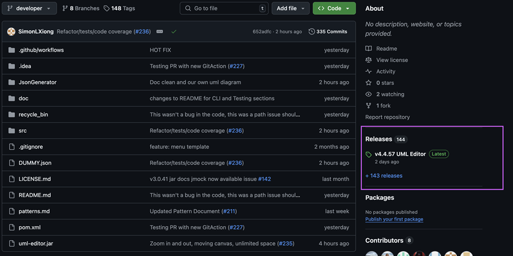
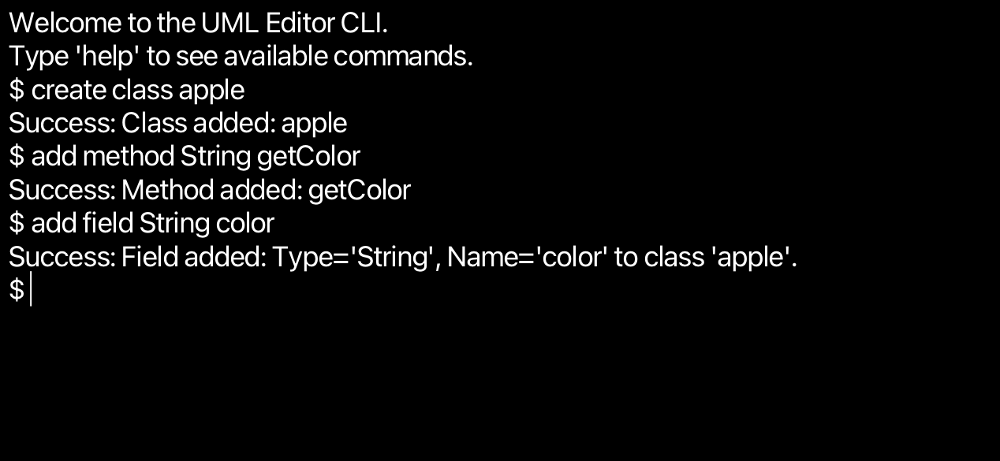

# UML Editor

* What's New:
  * See our latest for all documentation and JAR executables
* Major changes:
  * 
---

## Table of Contents

1. [Getting Started for User](#getting-started-for-User)
2. [Running the Application for User](#running-the-application-for-User)
3. [Overview](#overview)
4. [Features](#features)
5. [Installation for Developers](#installation-for-Developers)
6. [Testing](#testing)
7. [Testing for Code Coverage](#How-to-View-Code-Coverage-for-the-Project)
8. [Dependencies](#Dependencies)
9. [Contributing](#contributing)
10. [License](#license)
11. [Contact](#contact)
12. [Project Details/Technical Document include Usage](#Project-Details)
---

## Getting Started for User

### Prerequisites

Ensure that the following software is installed on the target machine:

- **Java Runtime Environment (JRE)** or **Java Development Kit (JDK)** version 21.0.5 or higher.  
  You can download it from the [Oracle Java Downloads page](https://www.oracle.com/java/technologies/javase-downloads.html) or **Highly Recommend** [GraalVM for JDK 21.0.5](https://www.oracle.com/java/technologies/downloads/?er=221886#graalvmjava21).
- Any JDK 21+ is able to run project with **JavaFX** version 23.0.1.
- 32bit Systems are not supported (Use at users own risk)
---

## Running the Application for User

### Steps to Run the UML Editor

### 1. Obtain the Program File
Download the package https://github.com/hbarton2/cscd350-f24-AndTheyWereRoomates.git

### 2. Click on latest UML Editor release


### 3. Download the source code for the project labeled below.


### Navigate to where the package was downloaded and extract the files
Once extracted, you will find three corresponding operating system directories. Each directory contains a UML-editor.jar executable.


### Steps to Open Terminal and Run `uml-editor.jar`

2. **Locate `uml-editor.jar`**:
    - Navigate to the directory where `uml-editor.jar` is located using your file explorer.

3. **Open Terminal/Command Prompt**:
    - **On Windows**:
        - Right-click inside the folder (not on the file) and select `Open in Terminal` or `Open PowerShell window here`.
    - **On macOS**:
        - Open Terminal, then type `cd` followed by a space.
        - Drag and drop the folder containing `uml-editor.jar` into the Terminal window.
        - Press `Enter` to navigate to the folder.
    - **On Linux**:
        - Open Terminal, then type `cd` followed by a space.
        - Drag and drop the folder containing `uml-editor.jar` into the Terminal window.
        - Press `Enter` to navigate to the folder.

4. **Run the JAR File**:
    - Type the following command in the commandLineTerminal:
      ```bash
      java -jar uml-editor.jar
      ```
    - Press `Enter` to execute the command.

*Did you know? If this file is currently viewed in a dedicated markdown viewer, you can click the arrow icon next to the bash command and launch the application.*


---

## Overview

DevKitUML is a unified modeling language (UML) software development kit (SDK) designed to simplify the process of generating, managing, and interacting with UML diagrams for developers. This project integrates a console-based interface for UML Editor functionality.

This SDK is intended to streamline the experience of creating class diagrams, modifying them, and saving/loading project data using JSON format for persistence.

---

## Features

- **Command-Line Interface (CLI):** Provides a commandLineTerminal-like environment where users can execute commands within the JavaFX commandLineTerminal window.
- **Graphical User Interface (GUI):** Application has an elegant, easy-to-use graphical interface for an enhanced user experience.
- **JSON Integration:** Uses Gson for saving/loading the project data in JSON format.
- **Multi-platform Support:** Designed to work on Windows, macOS, and Linux with cross-platform capabilities.

---

## Installation for Developers

### Prerequisites

Before running the project, ensure you have the following installed:

- **Java JDK 21.0.5**
- **Maven 3.9.9**

### Project Dependencies

The project uses the following dependencies, which are defined in the `pom.xml` file:

See the `pom.xml` file for full details on dependencies.
See [Dependencies](#Dependencies) for details preview.

### Building the Project

You can build the project using Maven. From the project root directory(where `pom.xml` is located)
run:

```bash
mvn clean package
mvn install
```

### Step-by-Step Instructions

```angular2html
src/main/java/uml-editor/EntryPoint.java
```

1. Clone the repository:
   ```bash
   git clone https://github.com/hbarton2/cscd350-f24-AndTheyWereRoomates
   cd cscd350-f24-AndTheyWereRoomates
   ```
   
2. Build the project using Maven:
   ```bash
   mvn clean package
   mvn install
    ```   

3. Run the project:
   ```bash
   java -jar target/original-uml-editor-shaded.jar
   ``` 
---

### JSON Integration
The project uses Gson for storing and loading UML project data as JSON files. The data includes class names, attributes, and methods, allowing for an easily shareable format.

### Testing


JUnit 4 or 5 and Mockito is used for all testing throughout the project. To run the tests, use:

```bash
mvn test
```
## How to View Code Coverage for the Project
- To access the current code coverage for the project, which is essential for writing effective tests, follow these steps:

- Navigate to GitHub and open the project repository.

- Go to the Actions tab(for the latest report per Pull Request) or Releases.

- Code coverage details are available under every action event as artifacts. This makes it easy to stay informed about the current state of the code.

- While using this tool, developers can ensure high-quality code and write effective tests.

- For every Latest Release will have `code-coverage-report.zip`


- Go to the file you just downloaded and open it and open the file `index.htm`.


- Once you open that file you should be able to see the current code coverage of the project.


---

## Run Tests
To run unit tests, execute the following command:
```bash
mvn test
```
Testing is performed using JUnit 5 and includes:
- Unit tests for core functionalities.
- Integration tests for external API calls.

You can find tests under the src/test directory.

---
# Dependencies

## Runtime Dependencies

- **[JLine (3.21.0)](https://github.com/jline/jline3)**  
  Used for handling command-line input and key detection for autocomplete.

- **[Apache Lucene](https://lucene.apache.org/core/) (9.7.0)**
    - `lucene-core`: Core library for text indexing and search.
    - `lucene-suggest`: Used for autocomplete suggestions.
    - `lucene-codecs`: Provides custom encoding/decoding for Lucene indexes.
    - `lucene-analysis-common`: Supports common text analysis tasks (e.g., tokenization).

- **[JavaFX (21.0.5)](https://openjfx.io/)**
    - `javafx-base`: Core JavaFX functionalities.
    - `javafx-graphics`: Graphics and rendering support.
    - `javafx-controls`: Provides UI components.
    - `javafx-fxml`: Enables FXML support for UI development.

- **[GSON (2.11.0)](https://github.com/google/gson)**  
  A library for converting Java objects to JSON and vice versa.

- **[Glisten (0.1.0)](https://github.com/gluonhq/glisten)**  
  GluonHQ's library for enhancing JavaFX with material design components.

- **[XBean Reflect (3.7)](https://github.com/xbean/xbean)**  
  Provides reflection utilities for Java applications.

## Testing Dependencies

- **[JUnit (4.13.2)](https://junit.org/junit4/)**  
  JUnit 4 for basic unit testing.

- **[JUnit Jupiter API (5.10.0)](https://junit.org/junit5/)**  
  JUnit 5 for modern, modularized testing.

- **[Mockito Core (5.5.0)](https://site.mockito.org/)**  
  For mocking objects during unit testing.

- **[Mockito JUnit Jupiter (5.5.0)](https://site.mockito.org/)**  
  Provides integration between Mockito and JUnit 5.

## Build Tool Plugins

- **[Maven Compiler Plugin (3.13.0)](https://maven.apache.org/plugins/maven-compiler-plugin/)**  
  Ensures the project compiles with Java 17.

- **[Maven Shade Plugin (3.6.0)](https://maven.apache.org/plugins/maven-shade-plugin/)**  
  Packages the project as an executable JAR with all dependencies included.

- **[Spotless Maven Plugin (2.37.0)](https://github.com/diffplug/spotless/tree/main/plugin-maven)**  
  Ensures consistent code formatting for Java, JSON, and YAML files, adhering to Google Java Style.

- **[JavaFX Maven Plugin (0.0.8)](https://github.com/openjfx/javafx-maven-plugin)**  
  Helps integrate JavaFX applications with Maven.

---
### Additional Notes
Ensure you have the correct Java version (Java 21.0.5) and Maven installed to use these dependencies effectively.

## Contributing

Currently, no outside contribution are allowed.

---

## License
Please see LICENSE.md

---

## Contact

For any inquiries, feel free to reach out

---

## Project Details

## Table of contents for GUI
1. [GUI Instructions](#gui-instructions)
2. [Workspace UI](#workspace-ui)
3. [Select Objects](#selecting-objects)
4. [Class Buttons](#class-editing)
5. [Field Buttons](#field-editing)
6. [Method Buttons](#method-editing)
7. [Parameter Buttons](#parameter-editing)
8. [Relationship Buttons](#relationship-editing)
9. [Known Bugs](#known-gui-bugs)

## Table of contents for CLI
1. [CLI Introduction](#cli-introduction)
2. [CLI Overview](#cli-overview)
3. [CLI Usage](#cli-usage)
    * [General Commands](#general-commands)
    * [Add Commands](#add-commands)
    * [Remove Commands](#remove-commands)
    * [Rename Commands](#rename-commands)
4. [Known Bugs](#known-bugs)


---

## CLI Introduction
Upon booting up in CLI mode, you'll be presented with the terminal. You should see a line saying

`Welcome to our UML Editor application
If you would like a list of commands enter 'help'`

and you should see a dollar sign `$` on the far left of the terminal.

## CLI Overview
##Features
* Add Command - Add classes, methods, fields, relationships
* Remove Commands - Removes class, methods, fields and relationships.
* Rename Commands - Rename classes, methods, fields and relationships


## CLI Usage

From here you'll be able to type in commands and start editing. Down below are all the commands you'll be able to type into the command line.

---
## General Commands
* Please make sure to read new CLI Introduction before reading this section.
* These commands are general commands that can be used in the CLI.

1. help - displays all possible commands.

2. list detail - Lists everything in the currently selected class.

3. list classes - List all created classes.
    * Example: `list classes`
   
4. save As `<filename>` - saves the current project as one json. It will ask you to input a name after typing in the command.
    * Example: `save as fruitbowl.json`
   
5. load file `<filename>`- loads a json as a UML class. It will ask you to input a name after typing load.
    * Example: `load file fruitbowl.json`
   
6. switch class `<classname>`- sets an existing class as the current class for quick editing.
    * Example: `switch class apple`
   
7. redo - Redoes the most recent undone action.
    * Example: `redo`
   
8. undo  - Undoes the most recent action.
    * Example: `undo`
   
9. new project - Resents the application to a fresh state, clearing all existing data.
    * Example: `new project`

10. clear - Clears the terminal screen.
    * Example: `clear`

11. exit - Exits the program
    * Example: `exit`
---
## Add Commands
* Please make sure to read CLI Introduction before reading this section.
* These commands add things to the editor.

1. create class `<class name>` - creates a class with that name
    * Example: `create class Apple`

2. add method `<return type> <method name>` - creates a method with the given name and following parameters
    * Example: `add method Boolean eat`

3. add field `<field type> <field name>` - creates a field with the given name and type. You will need to type in a type otherwise it won't work.
    * Example: `add field String color`

4. add parameter `<method name> <parameter type> <parameter name> [<parameter type> <parameter name> ... ]` - creates a parameter with the given name and type. This requires a method to exist in order to work
    * Example: `add parameter eat food String`

5. add relationship `<relationship type> <target class name>` - creates a relationship between two existing classes.
    * Example: `add relationship Apple Banana Aggregation`
---
## Remove Commands
* * Please make sure to read CLI Introduction before reading this section.
* These commands remove things in the editor.

1. remove class `<classname>` - removes the class that is currently set
   These commands remove things in the editor.
    * Example: `remove class Apple`

2. remove method `<method name> [<parameter type> <parameter name> ... ]` - removes a method with the given name optionally with specific parameters, from the currently set class. 
    * Example: `remove method method1`

3. remove field `<field name>` - removes a field with the given name
    * Example: `remove field field1`

4. remove parameter `<method name> <parameter name> [<parameter name> ... ]` - removes a parameter with the given name
    * Example: `remove parameter method1 param1`

5. remove relationship `<existing class name> <different existing class name> <relationship type>` -  removes a relationship between two existing classes.
    * Example: `remove relationship Apple Banana Aggregation`
---
## Rename Commands
* Please make sure to read CLI Introduction before reading this section.
* These commands rename things in the editor.

1. rename class `<old class name> <new class name>` - renames the currently selected class to the new name
    * Example: `rename class Apple Banana`

2. rename method `<existing method name> <new method name>` - renames a method in currently selected class to the new name
    * Example: `rename method method1 method2`

3. rename field `<existing field name> <new field name> <new field type>` - renames a method in currently selected class to the new name
    * Example: `rename field field1 field2 String`

4. rename parameter `<methond name> <old parameter name> <new parameter name>` - renames a parameter in currently selected class to the new name
    * Example: `rename parameter method1 param1 param2`
---

## Known Bugs

---
## Sample Workflow
1. View available commands.
   * Type help to display all possible commands.
   * Example: `help`
   
   
2. Create a class.
   * Type create class followed by the class name to create a new class.
   * Example: `create class apple`
   
   
3. Add methods to the class.
   * Type add method followed by the method's return type and name to add a method to the current class.
   * Example: `add method String getColor`
   
   
4. Add fields to a class.
   * Type add field followed by the field's type and name to add a property to the current class.
   * Example: `add field String color`
   
   
5. Add relationship between classes.
   * First, create another class. Then, type add relationship followed by the relationship type and the target class name to link the classes.
   * Example: `create class bannana`
   * `switch class apple`
   * `add relationship Aggregation bannana`
   
   
6. View added elements in class.
   * To see all attributes and relationships of the current class, then type list class.
   * Example: `list detail`
   
   
7. Save the UML diagram.
   * Type save as followed by the desired file name to save the current UML diagram.
   * Example: `save as apple`
   
   
8. Load a saved UML file.
   * Type load file followed by the name of the saved file to load a UML diagram.
   * Example: `load file apple`

   
9. Exit the program.
   * When finished,type exit. This closes the program.
   * Example: `exit`

---


# GUI Instructions

Upon booting up in GUI mode, you'll be presented with a new window titled "UML EDITOR".
You should see this window upon boot up.


## Workspace UI
This is a general breakdown of what does what in the UI. A more detailed breakdown for each part is below in this document.


1. **Workspace** - This where your work will appear
2. **Class Editor** - These buttons edit classes in your workspaceS
3. **Field Editor** - These buttons edit fields in a class
4. **Method Editor** - These buttons edit methods in a class. The buttons to add/remove/rename are seperated from the name text field
5. **Parameter Editor** - These buttons edit parameters in a method.
6. **Relationship Editor** - These button edit the relationship between two existing classes
7. **Miscellaneous** - These allow opening files, image exporting, undo/redo, and help


### Class UI


* If you wish to edit something in a particular field, click on the specified field to start editing.
* You can tell if you selected something in the list when it's colored blue.
1. Class - One entire rectangle is a Class, with Fields, Methods, and Parameters inside.
2. Fields - Where the fields are listed
3. Methods - Where Methods are listed
4. Parameter - Where Parameters are listed, inside one Method
5. Relationship - These indicate what relationship a class has with another class

## Selecting Objects
### Selecting a Class
If you want to select a class to edit, click the name of the box to select it for editing, otherwise you'll only
select it to move it around. You know you have a class selected if it has a red glow.
If the class name in the editing field is the same name as the object, you have it selected.
<br>
If you want to select attributes inside a class (in this example, a field), click the specific entry until
it is highlighted blue.
<br>


### Class Editing
These buttons all edit classes


1. **Add Class** - Creates a completely new blank class
2. **Delete Class** - Deletes a currently selected class
3. **Class Name:** - This text field is where the class name will display and where you can edit the name.
4. **Set Class Name** - Sets the name to the currently selected class if it's changed.

### Field Editing


1. **Field Name:** - This text field is where you'll input a name for the field.
2. **Type** - A dropdown field where you set what type the field is.
3. **Add** - A button that'll create a field based on the name in the field and the type. Both Name and Type have to be filled in to add a field
4. **Rename Field** - Renames a currently selected field. Click on the specific field to rename it
5. **Delete Field** - Deletes a currently selected field. Click on the specific field to remove it

### Method Editing


1. **Type** - A dropdown field where you set the type for the Method
2. **Method Name:** - This text field is where you'll input a name for the method.
3. **Add Method** - Adds a method to the given class
4. **Delete Method** - Deletes a currently selected method. Click on the specific field to remove it
5. **Rename Method** - Renames a currently selected method. Click on the specific field to rename it

### Parameter Editing


* To edit a parameter, you must have a Method first and have it selected
1. **Type** - This opens a dropdown display to select a type for the parameter
2. **Name:** - This text field is where you'll input a name for the parameter.
3. **Add Parameter** - Adds a parameter to a method
4. **Delete Parameter** - Deletes parameter in a method
5. **Rename Parameter** - Renames Parameter in a method

### Relationship Editing


* This requires two existing classes to work.
1. **From** - This opens a dropdown display to select an existing class, this is the sending end of the relationship, where the arrow starts from.
2. **To** - This opens a dropdown display to select an existing class, this is the receiving end of the relationship, where the arrow would point to.
3. **Type** - This opens a dropdown display to select the type of relationship between two classes
4. **Add Relation** - This creates a relationship between two classes, displaying as an arrow pointing from one class to another
5. **Delete Relation** - This deletes a relationship between two classes. The type needs to be set in order to remove the given relationship

### Miscelanious Editing


#### Files
* **Open** - Open a file to load into the GUI
* **New Project** - Creates a new project
* **Save** - Saves your current workspace into a JSON file
* **Export Imag**e - Exports out your workspace into a PNG file 
<br>(Located in *scr/main/resources/exports*)
* **Back to Main Menu** - Sends you back to the main menu where you can pick betwen GUI and CLI
* **Quit** - Shutdown program
#### Edit
* **Undo** - Undo your last action
* **Redo** - Redo your last undo.

## Known GUI Bugs

* For GUI default return types like "void" or certain data structures are not an option for the user 
* the relationship arrowheads do not rotate how they should
* Relationship arrows still overlap
* Class Boxes still overlap
* Dragging
---
