# UML Editor - CLI Technical Documentation

---
## Table of Contents

1. [CLI Introduction](#cli-introduction)
2. [CLI Overview](#cli-overview)
2. [CLI Usage](#cli-usage)
   * [General Commands](#general-commands)
   * [Add Commands](#add-commands)
   * [Remove Commands](#remove-commands)
   * [Rename Commands](#rename-commands)
3. [Sample Workflow](#sample-workflow)
4. [Known Bugs](#known-bugs)
---
## CLI Introduction
Upon booting up in CLI mode, you'll be presented with the terminal. You should see a line saying

`Welcome to our UML Editor application
If you would like a list of commands enter 'help'`

---
## CLI Overview
##Features
* Add Command - Add classes, methods, fields, relationships
* Remove Commands - Removes class, methods, fields and relationships.
* Rename Commands - Rename classes, methods, fields and relationships

## CLI Usage

From here you'll be able to type in commands and start editing. Down below are all the commands you'll be able to type into the command line.

---
## General Commands
* Please make sure to read CLI Introduction before reading this section.
* These commands are general commands that can be used in the CLI.

1. set class `<class name>` - sets the class to edit. A class needs to be set to edit its internals such as fields, methods, and parameters.
   * Example: `set class Apple`

2. help - displays all possible commands

3. help `<command>` - displays expanded commands for the given command.
   * Example: `help add class`
   * Example: `help remove method`
   * Example: `help rename field`

4. list class - Lists everything in the currently selected class

5. list classes - List all created classes
   * Example: `list classes`

6. save - saves the current project as one json. It will ask you to input a name after typing in the command.
    * Example: `save` -> `Enter file name: MyProject`

7. load - loads a json as a UML class. It will ask you to input a name after typing load
    * Example: `load` -> `Enter file name: MyProject`
   
8. exit - exits the program
---
## Add Commands
* Please make sure to read CLI Introduction before reading this section.
* These commands add things to the editor.

1. add class `<name>` - creates a class with that name
   * Example: `add class Apple`

2. add method `<name>` - creates a method with the given name
    * Example: `add method eat`

3. add field `<name> <type>` - creates a field with the given name and type. You will need to type in a type otherwise it won't work.
    * Example: `add field color String`

4. add parameter `<existing method> <name> <type>` - creates a parameter with the given name and type. This requires a method to exist in order to work
    * Example: `add parameter eat food String`

5. add relationship `<existing class name> <different existing class name> <Type>` - creates a relationship between two existing classes.
    * Example: `add relationship Apple Banana Aggregation`
---
## Remove Commands
* Please make sure to read CLI Introduction before reading this section.
* These commands remove things in the editor.

1. remove class `<name>` - removes the class that is currently set
These commands remove things in the editor.
    * Example: `remove class Apple`

2. remove method `<name>` - removes a method with the given name
   * Example: `remove method method1`

3. remove field `<name>` - removes a field with the given name
    * Example: `remove field field1`

4. remove parameter `<existing method> <name>` - removes a parameter with the given name
    * Example: `remove parameter method1 param1`

5. remove relationship `<existing class name> <different existing class name> <Type>` -  removes a relationship between two existing classes.
    * Example: `remove relationship Apple Banana Aggregation`
---
## Rename Commands
* Please make sure to read CLI Introduction before reading this section.
* These commands rename things in the editor.

1. rename class `<old name> <new name>` - renames the currently selected class to the new name
   * Example: `rename class Apple Banana`

2. rename method `<existing method> <new name>` - renames a method in currently selected class to the new name
   * Example: `rename method method1 method2`

3. rename field `<existing field> <new name> <new type>` - renames a method in currently selected class to the new name
   * Example: `rename field field1 field2 String`

4. rename parameter `<existing method> <existing parameter> <new name> <new type>` - renames a parameter in currently selected class to the new name
   * Example: `rename parameter method1 param1 param2 String`
---

## Known Bugs
1. Save does not work at the moment
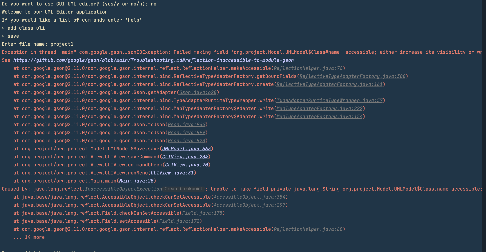
2. Add field (format) should be `add field <type> <name>` not `add field <name> <type>`

3. Rename Class does not work

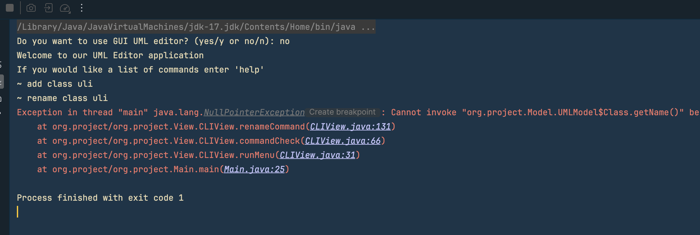
4. Method overloading is not implemented
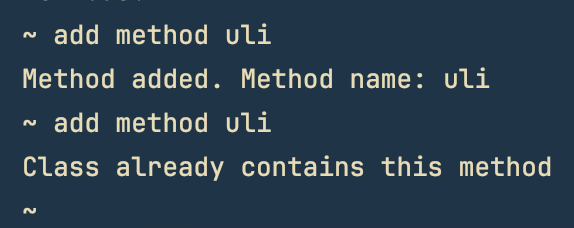
5. Load Feature does not work
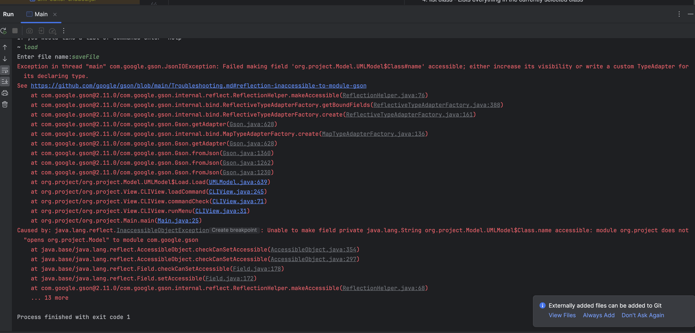
6. Add Field does not work (ArrayIndexOutOfBoundsException)
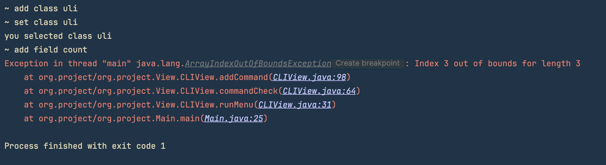
7. Add method bug - Breaks when the wrong amount of arguments is entered.
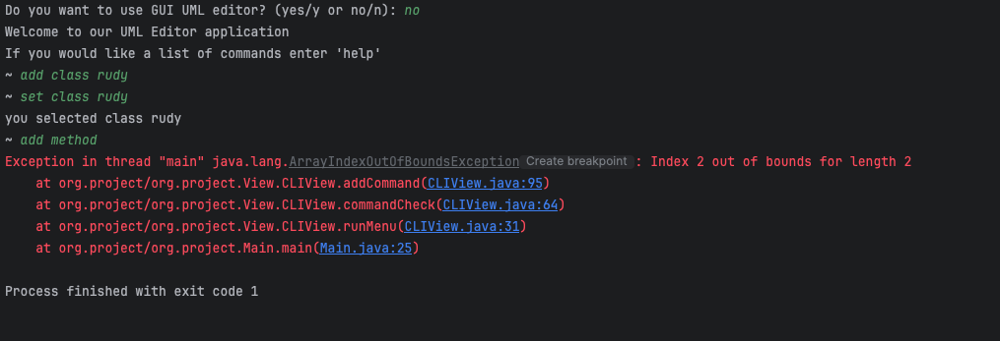
8. Rename Field does not work (ArrayIndexOutOfBoundsException)
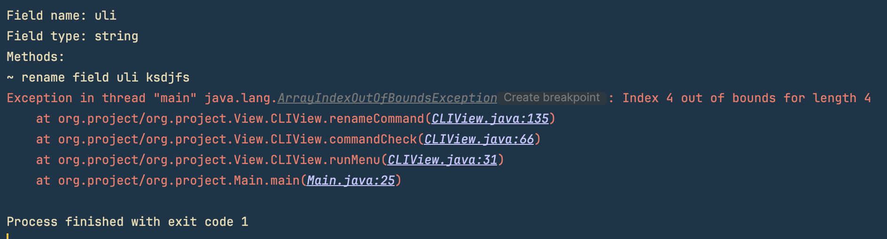
9. Add parameter bug - Breaks when the wrong amount of arguments is entered. 
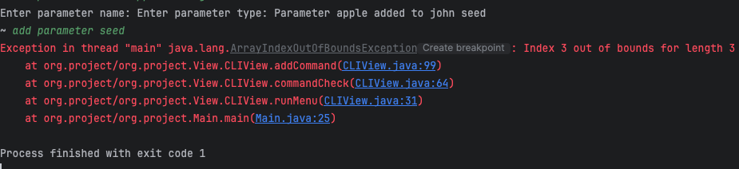
10. Rename Parameter bug - Breaks the program when invalid arguments is entered.
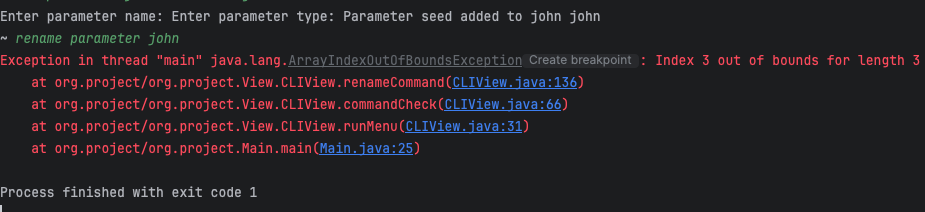
11. Remove field bug - Breaks the program. Error Displayed - (ArrayIndexOutOfBoundsException)
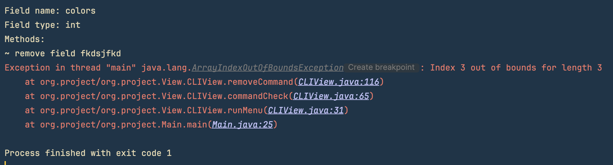
12. Remove Parameter bug - Null Pointer Exception
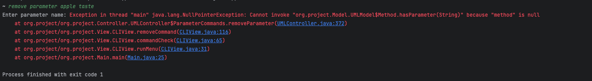
13. Add relationship bug - doesn't check for the 4 types of relationships (Aggregation, Composition, Generalization, Realization).
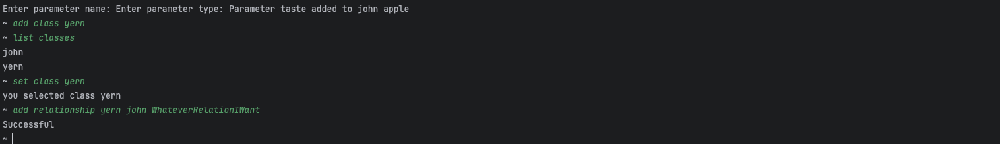
14. List classes bug - doesn't display the type of relationship between classes.
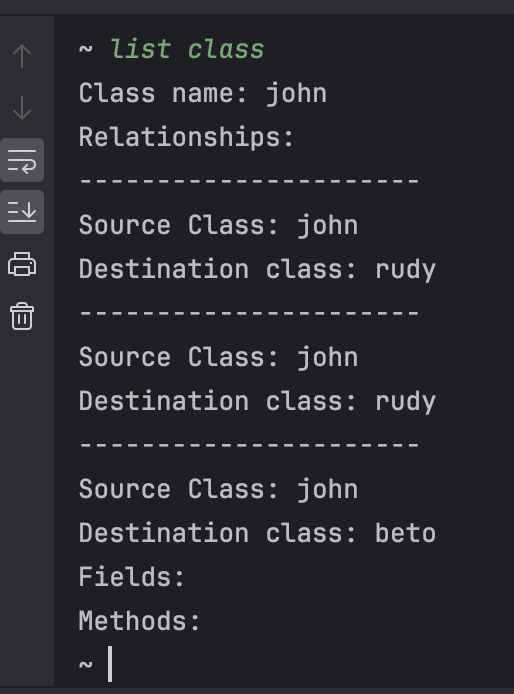
15. Printing Issues for parameter added.
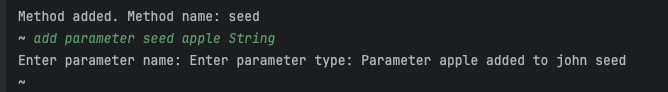 
16. Relationship bugs - Breaks program because it does not check for invalid inputs
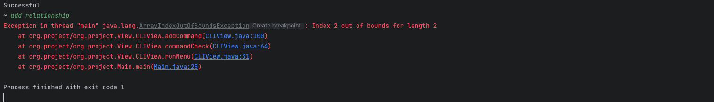
---
## Sample Workflow
Provide a simple walkthrough of how to use the CLI to create a UML diagram.

---

As a primer, typing '_help_' into the menu will bring up all the possible commands you can type into the command line, and typing 'help' with one of those commands will bring up an expanded explanation to all the associated commands.

Once the program starts, the first thing you need to add is a class.
Type 'add class ' and the name of the class you wish to add to create a class into the program. (ex: 'add class _apple_') and press the enter key.

You can add as many classes as you want, but you can't edit anything in the classes themselves. For example, if you try to add a method, you'll get a prompt telling you

`no class selected. Try: set class <class name>
`
   
You can't edit anything in a class until you set the class you want to edit. To set a class, type in 'set class ' and the name of an existing class you created (in this walkthrough: 'set class _apple_')
Once you do that, you'll see a confirmation text saying the class was set, and from here you can edit the class. You can use the rest of the add, remove, and rename commands.

To test that out, type 'add method ' and the name of the method you want to add. (ex: 'add method _banana_')
You can test out the other add commands, but keep in mind that adding a field, relationship, and parameter requires two, two and three inputs respectively in order to work (Detailed explanation in CLI Commands)

If you wish to edit another class, you'll need to type 'set class' with the name of another existing class that is created.

To see what you've added to the currently set class, type 'list class' to see how your class is set up.
What should display is everything added to the currently selected class.
If you want to see all the classes you created, type 'list classes' and it'll display all currently created classes.

Since you have something in the UML editor, to save the program, type 'save' to save everything you have into a json file.
The program should prompt text asking to type a name for the file. Name the file whatever you want and press the enter key, and you should see a json file with that name in the project folder.

If you want to load the file, type 'load'. This will prompt text asking for a file name in the project folder. The program will then prompt you to type in the name of a json file.
As a heads-up, you don't need to include ".json" in your input, the program looks for a json file with the name of what you input.
Assuming you typed in the name of the file, all your classes and every attribute tied to the classes should be loaded. (although if you're following along, it might be hard to notice considering you presumably didn't add anything after saving)

If you wish to see it work, you can restart the program (typing 'exit' closes the program) and on boot up, type in the load command along with the name of the json you saved, and type 'list classes' to see all the classes you saved.

This should give you the idea of how the UML editor works. If you need a reminder or further explanation for the commands, type 'help' for all the commands, and help and a command name after (ex: 'help add') to get a detailed explanation to all the commands.
## WorkFlow Sample
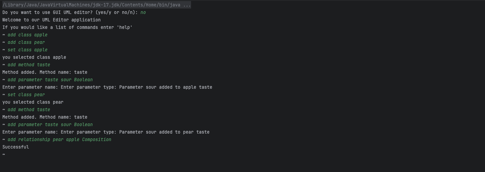

# GUI Instructions

Upon booting up in GUI mode, you'll be presented with a new window titled "UML EDITOR". 
You should see this window upon boot up.
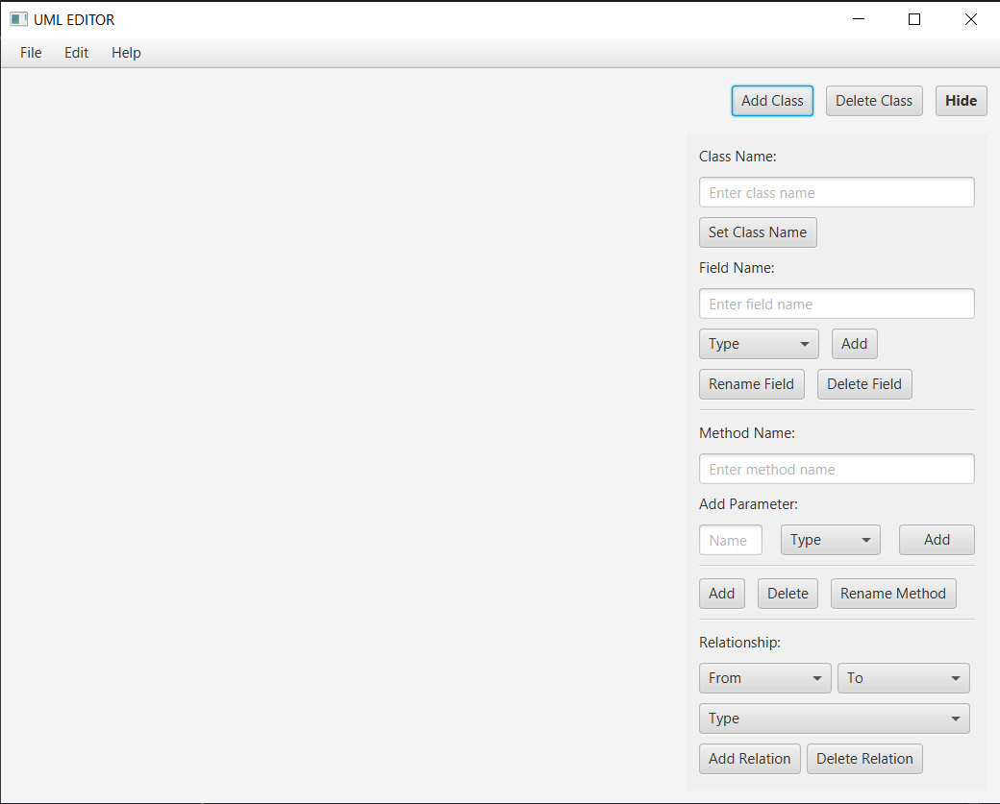

## GUI Usage
On this window, you'll be able to add classes and edit. Down below are a detailed explanation as to what 
buttons does what and how to interface with the program.

1. [Workspace UI](#workspace-ui)
2. [Select Objects](#selecting-objects)
3. [Class Buttons](#class-editing)
4. [Field Buttons](#field-editing)
5. [Method Buttons](#method-editing)
6. [Parameter Buttons](#parameter-editing)
7. [Relationship Buttons](#relationship-editing)
8. [Known Bugs](#known-gui-bugs)

## Window UI
This is a general breakdown of what does what in the UI. A more detailed breakdown for each part is below in this document.

### Workspace UI
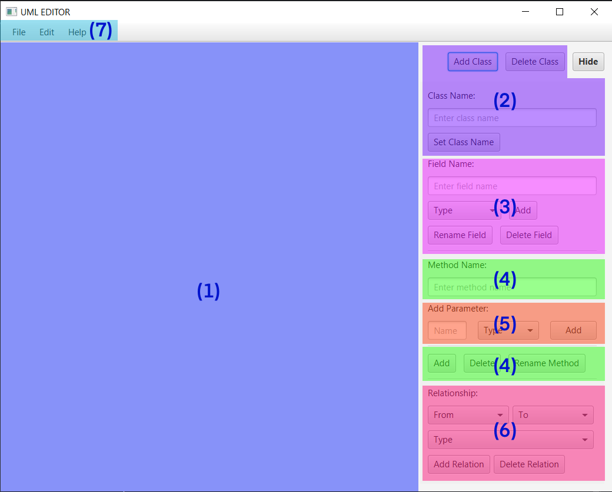

1. Workspace - This where your work will appear 
2. Class Editor Buttons - These buttons edit classes in your workspaceS
3. Field Editor Buttons - These buttons edit fields in a class
4. Method Editor Buttons - These buttons edit methods in a class. The buttons to add/remove/rename are seperated from the name text field
5. Parameter Editor Buttons - These buttons edit parameters in a method. 
6. Relationship Editor Buttons - These button edit the relationship between two existing classes
7. Miscellaneous Editing Dropdowns - These allow opening files, advance editing, and help

### Class UI
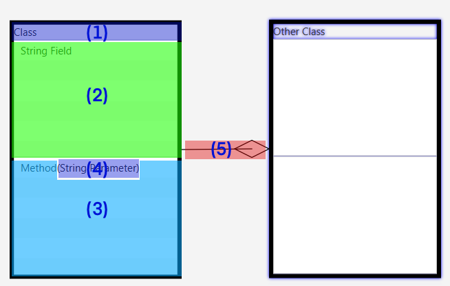

* If you wish to edit something in a particular field, click on the specified field to start editing.
* You can tell if you selected something in the list when it's colored blue.
1. Class - One entire rectangle is a Class, with Fields, Methods, and Parameters inside.
2. Fields - Where the fields are listed
3. Methods - Where Methods are listed
4. Parameter - Where Parameters are listed, inside one Method
5. Relationship - These indicate what relationship a class has with another class

## Selecting Objects
### Selecting a Class
If you want to select a class to edit, click the name of the box to select it for editing, otherwise you'll only
select it to move it around. You know you have a class selected if it has a blue glow, like this:

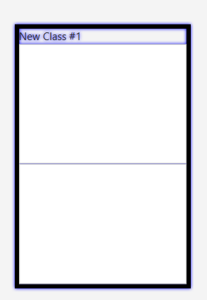
### Selecting components of a Class
If you want to select attributes inside a class (in this example, a field), click the specific entry until
it is highlighted blue like so:

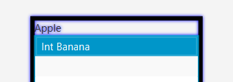

### Class Editing
These buttons all edit classes

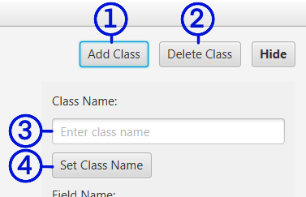
1. Add Class - Creates a completely new blank class
2. Delete Class - Deletes a currently selected class
3. Class Name: - This text field is where the class name will display and where you can edit the name.
4. Set Class Name - Sets the name to the currently selected class if it's changed.

### Field Editing

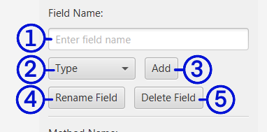
1. Field Name: - This text field is where you'll input a name for the field.
2. Type - A dropdown field where you set what type the field is. 
3. Add - A button that'll create a field based on the name in the field and the type. Both Name and Type have to be filled in to add a field
4. Rename Field - Renames a currently selected field. Click on the specific field to rename it
5. Delete Field - Deletes a currently selected field. Click on the specific field to remove it

### Method Editing

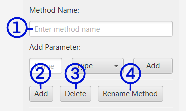
1. Method Name - This text field is where you'll input a name for the method.
2. Add - Adds a method to the given class
3. Delete - Deletes a currently selected method. Click on the specific field to remove it
4. Rename Method - Renames a currently selected method. Click on the specific field to rename it

### Parameter Editing

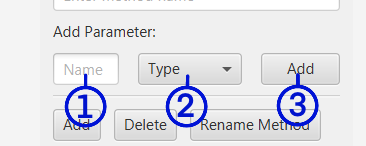
* To edit a parameter, you must have a Method first
1. Name - This text field is where you'll input a name for the parameter.
2. Type - This opens a dropdown display to select a type for the parameter
3. Add - Adds a parameter to a method

### Relationship Editing

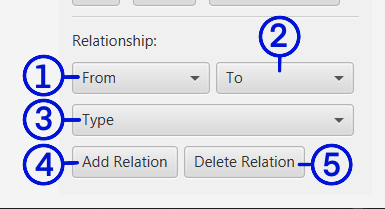
* This requires two existing classes to work.
1. From - This opens a dropdown display to select an existing class, this is the sending end of the relationship, where the arrow starts from.
2. To - This opens a dropdown display to select an existing class, this is the receiving end of the relationship, where the arrow would point to.
3. Type - This opens a dropdown display to select the type of relationship between two classes
4. Add Relation - This creates a relationship between two classes, displaying as an arrow pointing from one class to another
5. Delete Relation - This deletes a relationship between two classes. The type needs to be set in order to remove the given relationship

## Known GUI Bugs

1.  Relationship Display - General graphical weirdness creating a relationship between two classes. The line starts on the right and arrow is always on the 
left of a class, creating weird graphical issues of overlapping 
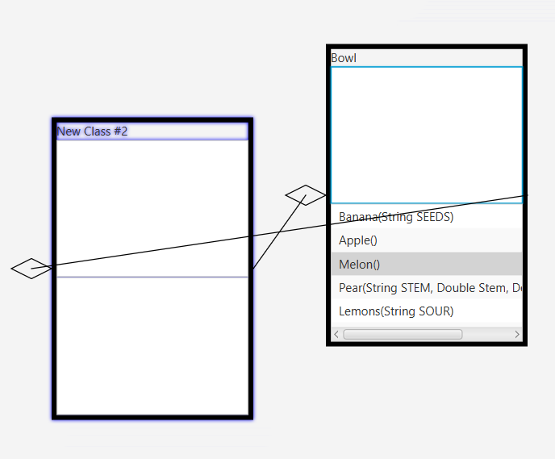
2.  Class Display - Newly created classes appear over existing classes.  
    Recreate: Create a new class, and then create a second class. Created class was moved to make the problem clear.

3.  Saving Option - Trying to save the GUI doesn't open file explorer.
    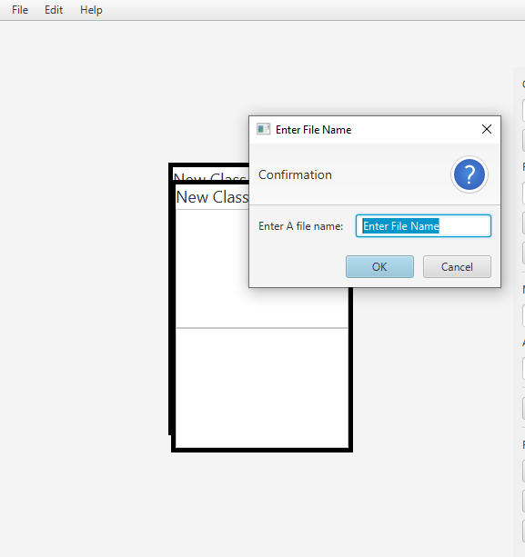